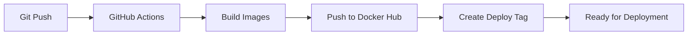

# MSTI Automation Deployment Setup

## 🎯 Hybrid GitHub + Laptop Deployment

**Problem Solved**: VPS berada di corporate network dengan VPN, GitHub Actions tidak bisa akses langsung.

**Solution**: GitHub Actions build images → Deploy dari laptop (yang sudah connect VPN).

## 📋 New Workflow

### **GitHub Actions (Automatic)**


### **Laptop Deployment (Manual)**


## 🚀 How to Use

### **1. Development & Build (Automatic)**
```bash
# Normal development workflow
git add .
git commit -m "your changes"
git push origin main

# GitHub Actions will automatically:
# ✅ Build backend & frontend images
# ✅ Push to Docker Hub
# ✅ Create deployment tag (deploy-TIMESTAMP-SHA)
# ✅ Ready for deployment notification
```

### **2. Check for New Deployments**
```bash
# Quick check di laptop Anda
./check-deploy.sh

# Output example:
# 🔍 Checking for new deployments...
# Latest available: deploy-20241215-143022-abc1234
# Currently deployed: deploy-20241215-120000-xyz5678
# 🚀 New deployment available!
```

### **3. Deploy to VPS**
```bash
# Deploy dari laptop (yang sudah connect VPN)
./deploy-from-laptop.sh

# Script will:
# ✅ Check VPS connection via VPN
# ✅ Sync deployment scripts
# ✅ Run blue-green deployment
# ✅ Verify health checks
# ✅ Show access URLs
```

## 🔧 One-time Setup

### **1. GitHub Secrets** (Simplified)
Go to GitHub repo → Settings → Secrets → Actions

**Required secrets:**
```
DOCKER_USERNAME=your-dockerhub-username
DOCKER_HUB_TOKEN=your-dockerhub-token
```

**No longer needed:**
- ~~DEPLOY_HOST~~ (not used)
- ~~DEPLOY_USER~~ (not used)  
- ~~DEPLOY_KEY~~ (not used)

### **2. VPS Setup** (One-time)
```bash
# Upload deployment scripts to VPS
scp -r deployment/ cisco@192.168.238.10:/opt/msti-automation/

# SSH to VPS and setup
ssh cisco@192.168.238.10
cd /opt/msti-automation
./deployment/vps-setup.sh
```

### **3. Laptop Setup** (One-time)
```bash
# Make scripts executable
chmod +x deploy-from-laptop.sh check-deploy.sh

# Test VPS connection
ssh cisco@192.168.238.10 "echo 'VPS connection OK'"
```

## 🎮 Commands Reference

### **Daily Workflow**
```bash
# 1. Code & push (trigger build)
git push origin main

# 2. Check if new deployment ready (run anytime)
./check-deploy.sh

# 3. Deploy when ready (manual)
./deploy-from-laptop.sh
```

### **Manual Commands**
```bash
# Quick deployment check
./check-deploy.sh

# Force deployment (deploy latest available)
./deploy-from-laptop.sh

# Manual deployment on VPS
ssh cisco@192.168.238.10
cd /opt/msti-automation
deployment/deploy.sh deploy

# Check VPS status
ssh cisco@192.168.238.10 "cd /opt/msti-automation && deployment/container-control.sh status"
```

### **GitHub Actions Manual Trigger**
```bash
# Force build semua images (via GitHub UI)
Go to: GitHub → Actions → "Build Images for MSTI Automation" → Run workflow
Set: force_build = true
```

## 🔍 Troubleshooting

### **VPS Connection Issues**
```bash
# Test VPN connection
ping 192.168.238.10

# Test SSH
ssh cisco@192.168.238.10 "echo 'Connection OK'"

# Check if deploy scripts exist on VPS
ssh cisco@192.168.238.10 "ls -la /opt/msti-automation/deployment/"
```

### **GitHub Actions Failed**
```bash
# Check workflow logs in GitHub
# Usually Docker Hub credentials or build issues

# Manual trigger with force build
GitHub → Actions → Run workflow → force_build: true
```

### **Deployment Failed**
```bash
# Check what went wrong
./deploy-from-laptop.sh

# Manual deployment
ssh cisco@192.168.238.10
cd /opt/msti-automation
deployment/container-control.sh status
deployment/deploy.sh deploy
```

### **Container Issues**
```bash
# Check containers on VPS
ssh cisco@192.168.238.10 "docker ps -a | grep msti"

# Check logs
ssh cisco@192.168.238.10 "docker logs msti-backend-blue"

# Force reset
ssh cisco@192.168.238.10 "cd /opt/msti-automation && deployment/container-control.sh stop-env blue && deployment/container-control.sh stop-env green"
```

## ✅ Benefits

### **vs Previous Workflow**
- ✅ **No VPN credentials** di GitHub
- ✅ **No always-on requirement** untuk laptop
- ✅ **Same blue-green deployment** dengan container lifecycle management
- ✅ **Better security** - semua traffic via VPN
- ✅ **Simpler GitHub Actions** - fokus ke build saja

### **vs Self-Hosted Runner**
- ✅ **Tidak perlu laptop always on**
- ✅ **Tidak perlu install GitHub runner**
- ✅ **Lebih fleksibel** - deploy kapan mau
- ✅ **Resource laptop tidak kepake** untuk build (GitHub Actions yang handle)

### **vs Pure Manual**
- ✅ **Automatic builds** di GitHub Actions
- ✅ **Automatic tagging** untuk track deployments
- ✅ **Consistent deployment process** dengan scripts
- ✅ **Health checks dan rollback** tetap otomatis

## 🌐 Access URLs

After successful deployment:
- **Frontend**: http://192.168.238.10:5172 (Blue) or http://192.168.238.10:5173 (Green)
- **Backend**: http://192.168.238.10:3001  
- **Webhook**: http://192.168.238.10:3002

Traffic switching otomatis handled by blue-green deployment system. 