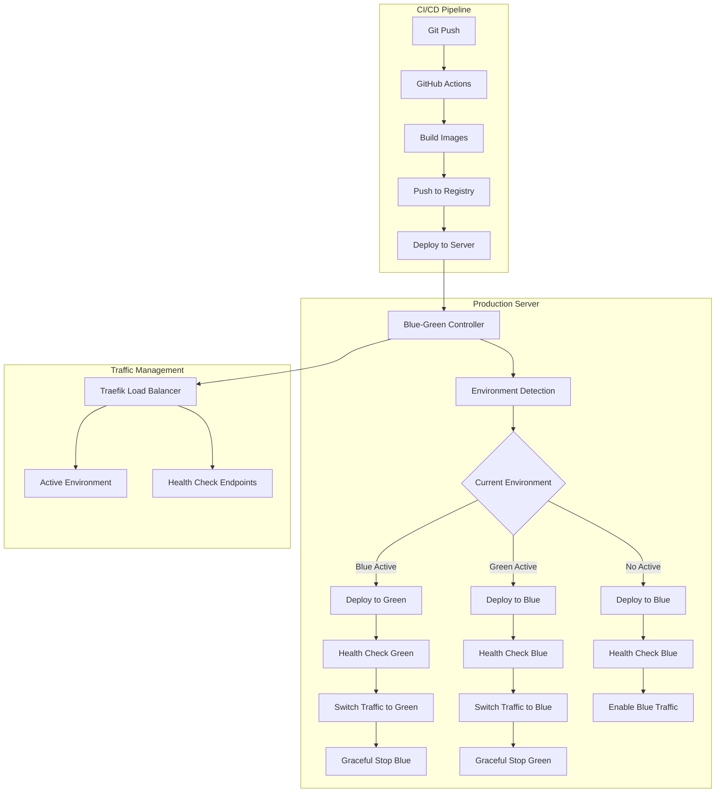

# DevOps Workflow Documentation
## MSTI Automation - Production-Ready Deployment

### Overview
Dokumen ini menjelaskan workflow DevOps yang telah dioptimasi untuk MSTI Automation dengan fokus pada **container lifecycle management yang proper**, blue-green deployment, dan automated CI/CD pipeline. Workflow ini mengatasi masalah yang sering dihadapi di mana container tidak bisa dihentikan secara graceful dan memerlukan manual process killing.

### Problem Solved: Container Lifecycle Management

#### Masalah Sebelumnya
```bash
# Masalah yang sering terjadi:
docker stop container_name  # Tidak berhasil graceful shutdown
docker exec container_name ps  # Masih ada process yang berjalan
docker exec container_name kill -9 PID  # Harus manual kill process
```

#### Solusi yang Diimplementasikan
1. **Proper Signal Handling** dengan Tini init system
2. **Graceful Shutdown Scripts** dengan timeout management
3. **Process Monitoring** dan automatic restart
4. **Health Check Integration** untuk container readiness
5. **Container Control Scripts** untuk automated lifecycle management

### Architecture Overview



### Container Lifecycle Management

#### 1. Enhanced Dockerfile dengan Tini
```dockerfile
FROM node:20-alpine

# Install tini for proper signal handling
RUN apk add --no-cache tini bash curl netcat-openbsd

# Create non-root user
RUN addgroup -g 1001 -S nodejs && adduser -S nodejs -u 1001

WORKDIR /app

# Copy and install dependencies
COPY package*.json ./
RUN npm ci --legacy-peer-deps && npm cache clean --force

# Copy application
COPY . .
RUN chown -R nodejs:nodejs /app

USER nodejs

# Health check
HEALTHCHECK --interval=30s --timeout=10s --start-period=40s --retries=3 \
    CMD curl -f http://localhost:$PORT/health || exit 1

# Use tini as init and proper entrypoint
ENTRYPOINT ["/sbin/tini", "--", "/app/entrypoint.sh"]
```

#### 2. Graceful Shutdown Entrypoint
```bash
#!/bin/bash
set -e

# Global process tracking
MAIN_PID=""
WEBHOOK_PID=""
SHUTDOWN_INITIATED=false

# Signal handling
graceful_shutdown() {
    if [ "$SHUTDOWN_INITIATED" = "true" ]; then
        return
    fi
    
    SHUTDOWN_INITIATED=true
    log "Initiating graceful shutdown..."
    
    # Stop webhook server
    if [ -n "$WEBHOOK_PID" ] && kill -0 "$WEBHOOK_PID" 2>/dev/null; then
        kill -TERM "$WEBHOOK_PID" 2>/dev/null || true
        wait_for_process_stop "$WEBHOOK_PID" 10
    fi
    
    # Stop main application
    if [ -n "$MAIN_PID" ] && kill -0 "$MAIN_PID" 2>/dev/null; then
        kill -TERM "$MAIN_PID" 2>/dev/null || true
        wait_for_process_stop "$MAIN_PID" 15
    fi
    
    exit 0
}

# Register signal handlers
trap 'graceful_shutdown' TERM INT QUIT
```

#### 3. Container Control Script
```bash
#!/bin/bash

# Container control untuk lifecycle management
graceful_stop_container() {
    local container_name=$1
    local timeout=${2:-30}
    
    log "Gracefully stopping container: $container_name"
    
    # Send SIGTERM
    docker kill --signal=SIGTERM "$container_name" 2>/dev/null || true
    
    # Wait for graceful shutdown
    local count=0
    while [ $count -lt $timeout ] && docker ps | grep -q "$container_name"; do
        sleep 1
        count=$((count + 1))
    done
    
    # Force kill if necessary
    if docker ps | grep -q "$container_name"; then
        docker kill "$container_name" 2>/dev/null || true
    fi
}
```

### Blue-Green Deployment Workflow

#### 1. Environment Structure
```yaml
# Blue Environment
services:
  backend-blue:
    container_name: msti-backend-blue
    stop_grace_period: 30s
    stop_signal: SIGTERM
    labels:
      - "deployment.environment=blue"
      - "traefik.enable=false"  # Disabled by default

# Green Environment  
services:
  backend-green:
    container_name: msti-backend-green
    stop_grace_period: 30s
    stop_signal: SIGTERM
    labels:
      - "deployment.environment=green"
      - "traefik.enable=false"  # Disabled by default
```

#### 2. Deployment Process
```bash
# 1. Detect current environment
current_env=$(get_active_environment)
next_env=$(get_next_environment $current_env)

# 2. Deploy to inactive environment
deploy_environment $next_env

# 3. Wait for health checks
wait_for_health $next_env

# 4. Run smoke tests
run_smoke_tests $next_env

# 5. Switch traffic
switch_traffic $next_env $current_env

# 6. Verify new deployment
verify_deployment $next_env

# 7. Graceful shutdown old environment
graceful_stop_environment $current_env
```

### CI/CD Pipeline

#### 1. GitHub Actions Workflow
```yaml
name: Build and Deploy MSTI Automation

on:
  push:
    branches: [ "main" ]
  workflow_dispatch:
    inputs:
      environment:
        type: choice
        options: [auto, blue, green]

jobs:
  detect-changes:
    # Detect if backend/frontend changed
    
  build-backend:
    # Build backend image if changed
    
  build-frontend:
    # Build frontend image if changed
    
  deploy:
    # Deploy using blue-green strategy
    steps:
      - name: Deploy to server
        run: |
          ssh user@server << 'EOF'
            cd /opt/msti-automation
            export IMAGE_TAG=${{ github.sha }}
            deployment/deploy.sh deploy
          EOF
      
      - name: Verify deployment
        run: |
          ssh user@server << 'EOF'
            deployment/container-control.sh status
            # Run health checks
          EOF
      
      - name: Rollback on failure
        if: failure()
        run: |
          ssh user@server << 'EOF'
            deployment/deploy.sh rollback
          EOF
```

#### 2. Deployment Commands
```bash
# Deploy latest version
deployment/deploy.sh deploy

# Deploy specific version  
IMAGE_TAG=v1.2.3 deployment/deploy.sh deploy

# Check status
deployment/deploy.sh status

# Manual rollback
deployment/deploy.sh rollback blue

# Stop environment
deployment/deploy.sh stop green

# Container-level control
deployment/container-control.sh stop-container msti-backend-blue 30
deployment/container-control.sh force-kill msti-backend-blue
deployment/container-control.sh health-check msti-backend-green
```

### Traefik Load Balancer Configuration

#### 1. Service Configuration
```yaml
# Traefik labels untuk blue environment
labels:
  - "traefik.enable=true"
  - "traefik.http.routers.backend-blue.rule=Host(`api.domain.com`)"
  - "traefik.http.services.backend-blue.loadbalancer.server.port=3001"
  - "traefik.http.services.backend-blue.loadbalancer.healthcheck.path=/health"
  - "traefik.http.services.backend-blue.loadbalancer.healthcheck.interval=10s"
```

#### 2. Traffic Switching
```bash
# Enable new environment
docker update --label-add "traefik.enable=true" msti-backend-green

# Disable old environment  
docker update --label-add "traefik.enable=false" msti-backend-blue
```

### Monitoring dan Health Checks

#### 1. Application Health Endpoints
```javascript
// Backend health check
app.get('/health', async (req, res) => {
  try {
    await prisma.$queryRaw`SELECT 1`;
    res.json({
      status: 'healthy',
      timestamp: new Date().toISOString(),
      uptime: process.uptime(),
      version: process.env.npm_package_version
    });
  } catch (error) {
    res.status(503).json({
      status: 'unhealthy',
      error: error.message
    });
  }
});
```

#### 2. Container Health Checks
```dockerfile
HEALTHCHECK --interval=30s --timeout=10s --start-period=40s --retries=3 \
    CMD curl -f http://localhost:$PORT/health || exit 1
```

#### 3. Deployment Verification
```bash
# Wait for container to be healthy
wait_for_container_health() {
    local container_name=$1
    local max_wait=${2:-120}
    
    local elapsed=0
    while [ $elapsed -lt $max_wait ]; do
        local status=$(check_container_health "$container_name")
        
        case $status in
            "healthy") return 0 ;;
            "starting") sleep 5; elapsed=$((elapsed + 5)) ;;
            *) return 1 ;;
        esac
    done
    
    return 1
}
```

### Database Migration Strategy

#### 1. Safe Migration Approach
```bash
# Migrations hanya pada deployment pertama
APPLY_MIGRATIONS=false  # Default untuk blue-green

# Manual migration jika diperlukan
docker exec msti-backend-blue npx prisma migrate deploy
```

#### 2. Rollback Considerations
```bash
# Backup database sebelum migration besar
docker exec postgres pg_dump -U user dbname > backup.sql

# Rollback process
deployment/deploy.sh rollback blue  # Traffic rollback
# Manual database rollback jika diperlukan
```

### Security Configuration

#### 1. Container Security
```dockerfile
# Non-root user
USER nodejs

# Read-only filesystem (optional)
# --read-only dengan tmpfs untuk writable dirs

# Security labels
LABEL security.scan="enabled"
```

#### 2. Network Security
```yaml
networks:
  traefik-public:
    external: true
  msti-blue:
    driver: bridge
    internal: false
  msti-green:  
    driver: bridge
    internal: false
```

### Performance Optimizations

#### 1. Resource Limits
```yaml
services:
  backend-blue:
    deploy:
      resources:
        limits:
          memory: 1G
          cpus: '0.5'
        reservations:
          memory: 512M
          cpus: '0.25'
```

#### 2. Build Optimizations
```dockerfile
# Multi-stage builds
FROM node:20-alpine AS builder
# Build stage

FROM node:20-alpine AS runtime
# Runtime stage dengan minimal dependencies
```

### Troubleshooting Guide

#### 1. Container Won't Stop Gracefully
```bash
# Check process tree
docker exec container_name ps aux

# Manual process termination
deployment/container-control.sh force-kill container_name

# Check signal handling
docker exec container_name kill -TERM 1
```

#### 2. Health Check Failures
```bash
# Check health status
docker inspect container_name | jq '.[0].State.Health'

# Manual health check
docker exec container_name curl -f http://localhost:3001/health

# Check logs
docker logs container_name --tail 50
```

#### 3. Deployment Rollback
```bash
# Check current environment
deployment/container-control.sh status

# Manual rollback
deployment/deploy.sh rollback previous_environment

# Emergency stop all
deployment/deploy.sh stop all
```

### Best Practices

#### 1. Container Lifecycle
- **Gunakan tini** sebagai init system
- **Implement graceful shutdown** dengan proper signal handling
- **Set appropriate timeouts** untuk stop_grace_period
- **Monitor process health** secara berkala

#### 2. Deployment Strategy
- **Always test** di environment non-production dulu
- **Keep old environment** running sampai verification selesai
- **Automated rollback** pada deployment failure
- **Database backup** sebelum migration besar

#### 3. Monitoring
- **Health checks** di multiple levels (app, container, load balancer)
- **Real-time alerts** untuk deployment failures
- **Resource monitoring** untuk memory/CPU usage
- **Log aggregation** untuk troubleshooting

### Usage Examples

#### 1. Normal Deployment
```bash
# Automatic deployment dari CI/CD
deployment/deploy.sh deploy

# Manual deployment dengan specific version
IMAGE_TAG=v1.2.3 deployment/deploy.sh deploy
```

#### 2. Container Management
```bash
# Stop container gracefully
deployment/container-control.sh stop-container msti-backend-blue 30

# Force kill jika graceful gagal
deployment/container-control.sh force-kill msti-backend-blue

# Check health
deployment/container-control.sh health-check msti-backend-blue
```

#### 3. Environment Management
```bash
# Stop entire environment
deployment/container-control.sh stop-env blue

# Switch traffic between environments
deployment/container-control.sh switch-traffic green blue

# Show current status
deployment/container-control.sh status
```

Workflow ini mengatasi semua masalah container lifecycle management dan memberikan deployment yang reliable, scalable, dan mudah di-maintain untuk MSTI Automation platform. 